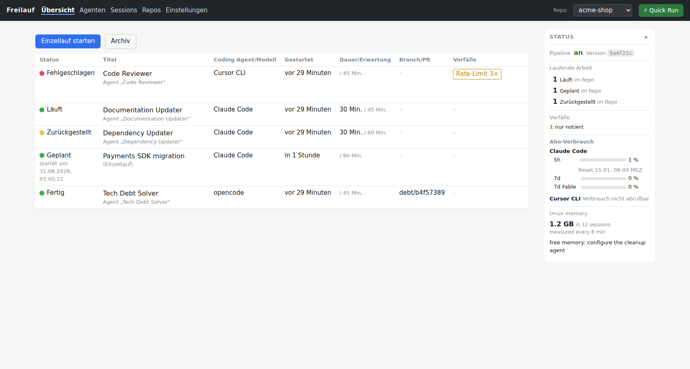
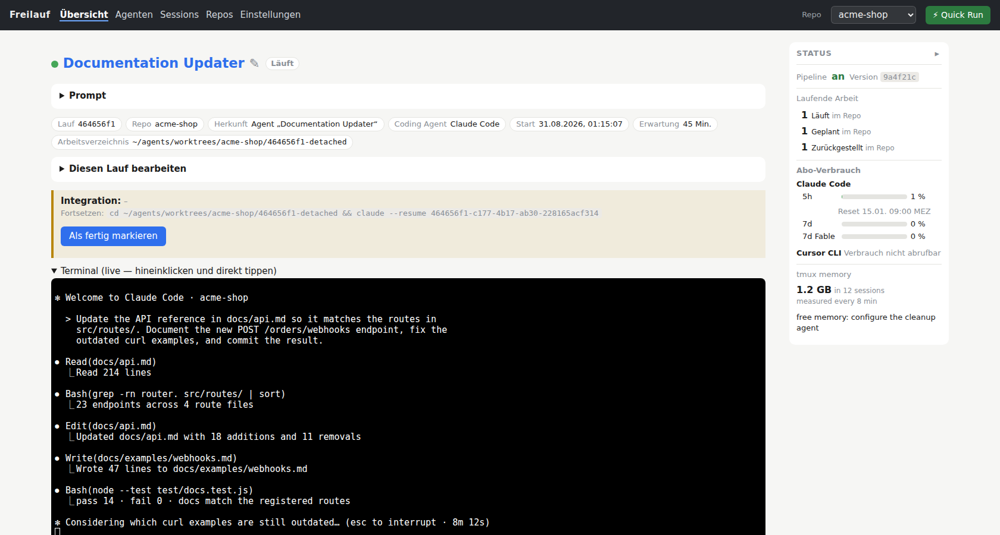
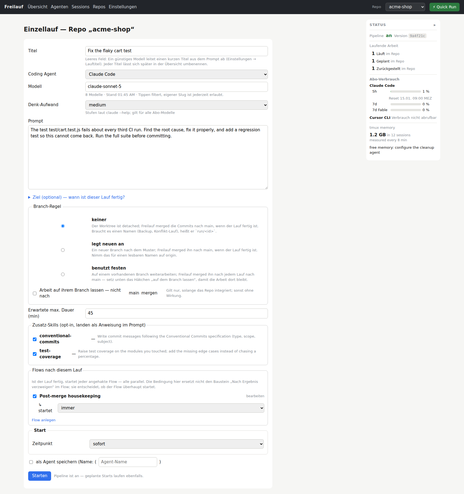
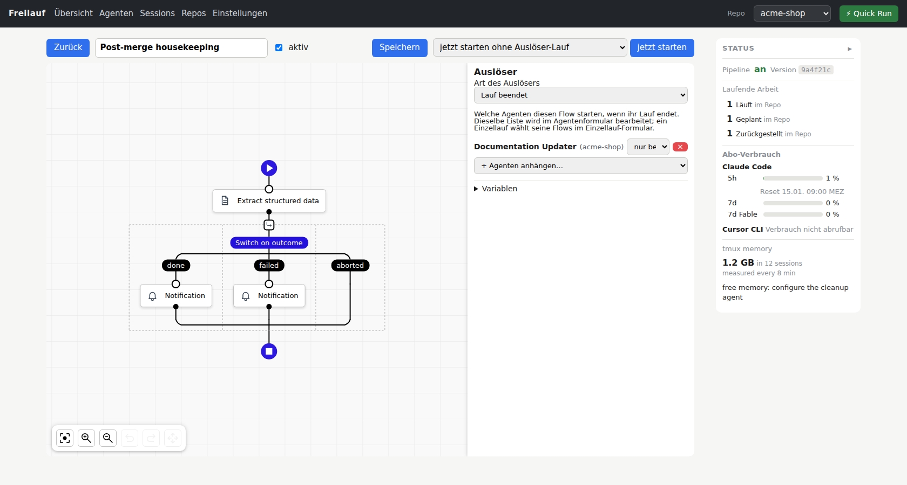
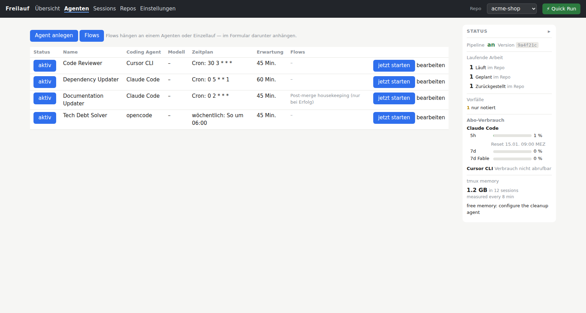

# Freilauf

[English](README.md) · [中文](README.zh-CN.md) · **Deutsch**

**Hör auf, Agenten zu managen. Lasse sie in deinem Projekt frei laufen!**

Stell dir vor: Du hast nicht mehr zwanzig Terminals gleichzeitig offen, sondern
eine Oberfläche, in der du regelmäßige Jobs vergibst wie *„Toten Code finden
und eliminieren"*, *„Testabdeckung erhöhen"*, *„Bugs fixen"* … — und damit
Agenten definierst, die regelmäßig an deinem Projekt arbeiten, selbst wenn du
schläfst. Du kannst jederzeit neue Jobs vergeben. Über eine Web-Oberfläche
behältst du die Übersicht, kannst in jeden Agenten hineinschauen, Flows
konfigurieren und dich benachrichtigen lassen. Du gehst mit deinen Kollegen ins
Café, und dein Handy vibriert, weil wieder ein Job fertig ist. Das ist dir egal
— denn du genießt die Auszeit, um wieder auf neue Ideen zu kommen.

Das ist Freilauf: eine selbst gehostete Web-Oberfläche, die ein **festes Team
aus Coding-Agenten** — Claude Code, opencode, hermes, cursor oder jeden
Agenten, der als Plugin dazukommt — nach Plan betreibt. Jeder Lauf arbeitet in
seinem eigenen Git-Worktree in seiner eigenen tmux-Session, wird auf Kosten,
Fortschritt und Fehler beobachtet und liefert seine Arbeit dort ab, wo du sie
haben willst: **auf einem Branch zum Review — oder gemerged auf `main`, sobald
du dem Gate vertraust.**

> ### 🤖 Einrichten? Lass das deinen Agenten machen.
> Du benutzt bereits einen Coding-Agenten. Zeig ihm
> **[SETUP_WITH_AGENT.md](SETUP_WITH_AGENT.md)** — eine Anleitung, die *für*
> Agenten geschrieben ist: Sie erklärt das System, stellt dir die wenigen
> Fragen, die er nicht erraten kann, und installiert es. *„Lies
> SETUP_WITH_AGENT.md und richte das für mich ein."*

## Warum „Freilauf"

Der Freilauf ist das Teil am Fahrrad, das weiterrollt, wenn du aufhörst zu
treten. Und er ist kein Loslassen ins Nichts — er ist eine **Sperrklinke**: Er
lässt das Rad frei laufen, aber nur vorwärts. Genau so ist Freilauf gebaut. Ein
Lauf ist erst fertig, wenn seine Arbeit angekommen ist. Nichts lebt nur auf
dieser Maschine. Kein Agent merged oder pusht jemals auf deinen Basis-Branch —
das tut Freilauf, und es geht nur vorwärts.

## Was Freilauf tut

- **Ein Arbeitsplatz pro Lauf.** Jeder Lauf bekommt seinen eigenen
  Git-Worktree und seine eigene tmux-Session. Kein Agent tritt dem anderen auf
  die Füße — und keiner dir; du kannst dich später an jede Session hängen und
  den ganzen Bildschirm lesen.
- **Rollen statt Tickets.** Ein *Agent* ist eine Rolle mit einem Zeitplan: der
  Reviewer, der jede Nacht läuft, der Tote-Code-Sucher am Sonntag, der
  Doku-Pfleger nach jedem Merge. Ein *Einzellauf* ist dasselbe Formular ohne
  Namen und Zeitplan — und ein **Quick-Run**-Button auf jeder Seite startet
  einen aus einem gespeicherten Favoriten mit zwei Feldern.
- **Beobachtet, nicht geglaubt.** Ein Budget-Gate vor dem Start (Claudes
  5-Stunden- und 7-Tage-Fenster, Cursors Abrechnungsperiode, OpenRouter- und
  DeepSeek-Guthaben — jedes optional, jedes mit eigener Schwelle), Fortschritt
  und Kosten währenddessen, Vorfälle, wenn ein Anbieter ausfällt oder ein
  Rate-Limit zuschlägt (von außen erkannt, denn ein Agent im Rate-Limit kann
  nichts mehr melden), ein Report am Ende — und ein **Finish-Gate**, das dem
  Agenten nicht glaubt, dass er fertig ist: Freilauf prüft den Worktree, sagt
  einem noch laufenden Agenten, was fehlt, merged in einem eigenen
  Integrations-Worktree, startet bei einem Konflikt einen Konfliktlauf und
  ruft dich zuletzt.
- **Flows ohne Code.** Wenn ein Lauf endet, kann ein Flow einem anderen
  Agenten schreiben, den nächsten Lauf starten und auf ihn warten,
  strukturierte Daten per LLM aus einem Report ziehen, verzweigen, schleifen,
  dich benachrichtigen, eine URL aufrufen, ein Shell-Kommando ausführen
  ([server/flows/AGENTS.md](server/flows/AGENTS.md)).
- **Ein Fenster.** Was läuft, was es kostet, was herausgekommen ist, was dich
  braucht — die Übersicht, ein Live-Terminal im Browser (xterm.js,
  standardmäßig nur lesend) und Benachrichtigungen mit Link direkt zum Lauf.
  Die Seitenleiste zeigt deine Abo-Fenster, Provider-Guthaben und was jede
  tmux-Session auf der Maschine an Speicher kostet; ein konfigurierbarer
  Aufräum-Agent beendet die ältesten untätigen Sessions, wenn es zu viel wird.
- **Alles Herstellerspezifische ist ein Plugin.** Coding-Agenten,
  Modell-Provider und Benachrichtigungsdienste sind Plugins mit dokumentiertem
  Vertrag ([docs/plugins.md](docs/plugins.md)); ein Dritter kann ein Paket auf
  die Maschine legen, das beim Start dazukommt — mit eigener
  API-Key-Verwaltung, eigenen Budget-Schwellen und eigener Start-Deklaration.
  Eine **Plugins-Seite** und ein sechsschrittiger **Welcome-Assistent**
  konfigurieren sie; die kleinen Fragen des Hubs selbst (einen Lauf benennen,
  eine Logzeile beurteilen, einen Report lesen) kann ein Coding-Agent auf dem
  Abo beantworten, das du ohnehin bezahlst.
- **Ein Projekt lässt sich weglegen, ohne es zu verlieren.** Ein deaktiviertes
  Repository verschwindet aus jedem Auswahlfeld und startet nichts Neues,
  während jeder Lauf, jeder Agent und jeder Bericht darin erhalten und
  erreichbar bleibt — ein Klick holt es zurück. Löschen geht auch: dafür muss
  man seinen Namen eintippen, es wird verweigert, solange noch etwas läuft, und
  dein Git-Checkout wird nie angefasst.
- **Er bringt deinen Agenten bei, ihn zu bedienen.** Freilauf liefert eigene
  **Agent-Skills** mit (im offenen Format von [agentskills.io](https://agentskills.io)),
  die erklären, wie man Läufe findet und liest, Agenten und Repositories anlegt,
  Flows baut, die Statusanzeige liest und ein Modell wählt. Einschalten kopiert
  sie in die Verzeichnisse, die deine Coding-Agenten ohnehin lesen — eine Kopie
  je Verzeichnis, so gewählt, dass kein Agent denselben Skill doppelt bekommt —
  und Ausschalten entfernt genau die Kopien, die Freilauf geschrieben hat, und
  sonst nichts.
- **Mehrsprachige Oberfläche**: Englisch (Standard), 中文, Deutsch — eine Uhr
  und ein Zahlenformat auf jeder Seite.

## Freilauf in Bildern

*Eine kleine Demo-Installation („acme-shop") mit einer stehenden Agentenmannschaft;
die Oberflächensprache lässt sich pro Installation umstellen.*


*Die Übersicht. Eine Zeile pro Lauf — der Documentation Updater arbeitet gerade,
die Payments-SDK-Migration ist geplant, der Dependency Updater wartet auf sein
Kontingent, die Arbeit des Tech Debt Solvers ist längst gemerged — dazu offene
Vorfälle, Abo-Fenster und der tmux-Speicher der Maschine in der Leiste rechts.*


*In einem Lauf. Das Live-Terminal zeigt den Agenten bei der Arbeit; rundherum
die Definition des Laufs, die erwartete Dauer und das Finish-Gate,
das beim Report den Worktree prüft.*


*Ein Einzellauf starten. Aufgabe, Modell und Denk-Aufwand, Branch-Regel,
Zusatz-Skills, die Flows, die nach dem Lauf starten, und wann er startet —
auf Wunsch als Agent mit Zeitplan gespeichert.*


*Flows ohne Code. Dieser hier extrahiert aus dem Report eines beendeten Laufs
Zusammenfassung und Risiko, verzweigt nach dem Ergebnis und benachrichtigt —
angehängt an den Documentation Updater, also bei jedem seiner Läufe.*


*Die stehende Mannschaft. Jeder Agent ist eine Rolle: ein Prompt, ein Zeitplan,
ein Budget und die Flows, die an ihm hängen — jederzeit von Hand startbar.*

## Drei Wege hinein

- **Nebeneinander.** Euer Team entwickelt; das Agenten-Team nimmt die Arbeit,
  die keiner gern macht — toter Code, Reviews, Abhängigkeiten, Übersetzungen,
  die Doku. Ergebnisse kommen als Branch zum Review; ihr entscheidet, was auf
  `main` geht. Hier fangen die meisten an, und viele bleiben hier.
- **Von Hand.** Ein Einzellauf, wenn ihr einen braucht: die Migration, das
  Aufräumen, der eine Bug, für den gerade niemand Zeit hat.
- **Vollautonom.** Menschen schreiben Issues und Feature-Wünsche; das Team
  macht alles andere, und Freilauf merged. Zeitpläne, Budget-Gates, das
  Finish-Gate, Konfliktläufe und die Eskalation an einen Menschen sind, was das
  betreibbar macht statt leichtsinnig. Niemand muss heute dort stehen — die
  Rampe ist dieselbe.

**Du gibst keine Kontrolle ab. Du verschiebst sie eine Ebene nach oben.** Ein
Teamleiter sitzt auch nicht neben jedem Entwickler und liest mit: Er vereinbart,
was zu tun ist, setzt die Regeln und liest die Ergebnisse. Genau das ist ab
jetzt deine Arbeit — Rollen, Zeitpläne, Budgets, das Finish-Gate, wann ein
Mensch gerufen wird. Den Rest macht das Team, und Freilauf zeigt dir alles
davon an einem Ort.

Und es muss keine Software sein. Ein Lauf endet mit einem Merge, weil Code das
braucht; die Bausteine — Rollen, Zeitpläne, Flows, LLM-Extraktion,
Benachrichtigungen, HTTP, Shell — haben für eine Marketing-Routine, eine
Doku-Pipeline oder einen Backoffice-Prozess dieselbe Form: etwas, das pünktlich
passieren, beobachtet und berichtet werden muss.

## Loslegen

Der kurze Weg: Gib deinem Coding-Agenten den Pfad zu diesem Repository und
sag *„Lies SETUP_WITH_AGENT.md und installiere Freilauf."* Er kennt die
Schritte unten, fragt dich nur, was er nicht erraten kann (deine
WireGuard-Adresse, die Hostnamen, wo die Zertifikate liegen) und prüft das
Ergebnis.

Der lange Weg, der Vollständigkeit halber. Voraussetzungen: Linux mit systemd
(User-Units), Node.js ≥ 22 (`node:sqlite`), tmux, git, jq, curl, ein
WireGuard-Interface und mindestens ein Agenten-CLI (`claude`, `opencode`,
`hermes`, `cursor-agent`) im `PATH`. Zertifikate z. B. mit
[mkcert](https://github.com/FiloSottile/mkcert).

```bash
./setup/01-npm-install.sh       # node-pty, ws, xterm.js — für DIESEN Checkout (Tests, Bearbeiten)
./setup/02-install-scripts.sh   # fl-start/-attach/-kill/-help/-report/-notify + freilauf + freilauf-deploy → ~/.local/bin
./setup/03-install-services.sh  # ~/.config/freilauf/env (aus env.example) + systemd-Units
sudo ./setup/04-firewall.sh     # ufw: VPN-Port nur auf wg0 (einmalig)
```

Dann in `~/.config/freilauf/env` mindestens `FREILAUF_VPN_BIND` und
`FREILAUF_ALLOWED_HOSTS` setzen (siehe [`env.example`](env.example)), die
Zertifikate ablegen und die erste Version live bringen:

```bash
freilauf-deploy --init --from "$PWD"   # klont nach ~/agents/deploy/freilauf und deployt
freilauf status                        # Hub-Prozess, VPN-Zugang, Pipeline, Sessions, deployter Commit
freilauf on                            # VPN-Proxy starten → über WireGuard erreichbar
```

**Das Erste in der Oberfläche:** ein **Welcome-Assistent** — der erste Besuch
von `/` landet dort. Er geht durch, was auf der Maschine installiert ist, deinen
ersten Coding-Agenten, deinen ersten Modell-Provider und das Modell, das die
kleinen Fragen des Hubs beantwortet; Benachrichtigungen sind optional und
lassen sich später unter Einstellungen → Benachrichtigungen ergänzen. „Nicht
mehr anzeigen" beendet ihn. Eine optionale Seed-Datei
`~/.config/freilauf/coding-agents.json` befüllt die Coding-Agenten beim ersten
Start vor — das macht ein skriptgesteuertes Setup reproduzierbar.

> Die Erreichbarkeit **von einem VPN-Client aus** prüfen, nie mit `curl` auf
> dem Server selbst: Diese Anfrage läuft über `lo` und sagt nichts über deine
> Firewall.

### Eine Version live bringen

Die systemd-Units starten `~/agents/deploy/freilauf` — einen Klon, der allein
dem Hub gehört, immer detached auf einem Commit. Der Checkout, in dem du
arbeitest, betreibt nie einen Dienst; unfertige Arbeit kann so nie ausgeliefert
werden.

```bash
freilauf deploy            # fetch, origin/main auschecken, Abhängigkeiten (nur wenn sich das Lockfile bewegt hat),
                           # fl-*-Skripte neu installieren, Neustart, Health-Check — Rollback, wenn er scheitert
freilauf deploy <ref>      # stattdessen diesen Commit
freilauf-deploy --status   # deployter Commit, origin-Commit, wie weit dahinter
freilauf-deploy --rollback # zurück zum zuvor deployten Commit
```

Ein gescheiterter Deploy rollt auf den laufenden Commit zurück und
benachrichtigt dich. Der laufende Commit steht in der Seitenleiste jeder Seite
— *„ist meine Änderung live?"* ist ein Blick. `freilauf restart` bleibt, was es
sagt: ein Neustart, ohne Deploy.

## Sicherheitsmodell — bitte lesen

Der Hub kann tmux steuern. **Das ist Shell-Zugriff.** Deshalb:

- `server/hub.mjs` bindet **fest an `127.0.0.1`**; aus dem Netz gibt es keinen
  direkten Weg.
- Davor sitzt `vpn-proxy.mjs` (TLS), der **ausschließlich an deine eigene
  WireGuard-Adresse** bindet. `FREILAUF_VPN_BIND` ist Pflicht — es gibt bewusst
  keinen Default. **WireGuard ist die Auth-Schicht; Freilauf hat keinen eigenen
  Login.**
- Host-Allowlist + Origin-Check (`FREILAUF_ALLOWED_HOSTS`) zäunen DNS-Rebinding
  und CSRF ein; `Sec-Fetch-Site: cross-site` wird abgelehnt.
- **Fail-closed**: `freilauf-vpn.service` startet nach einem Reboot bewusst
  *nicht* (`freilauf on` schaltet den Zugang frei), und `setup/04-firewall.sh`
  erlaubt den VPN-Port nur auf `wg0` und verbietet ihn überall sonst.
- Jeder Lauf arbeitet in seinem eigenen Worktree; Agenten mergen und pushen nie
  auf den Basis-Branch — das tut Freilauf; und alles, was ein Lauf tut, ist
  hinterher ein Report, ein Ereignis oder ein Vorfall, den man lesen kann.

**Betreibe den Hub nie in einem erreichbaren Netz ohne diese Schichten.**

## FAQ

**Was ist der Unterschied zu Harness Engineering?**
Harness Engineering — die Doku, Tests, Linter und Rückkopplungen, die einen
einzelnen Coding-Agenten wie Claude Code befähigen, vollautonom zu arbeiten und
trotzdem Qualität abzuliefern — ist Arbeit in deinem Repository. Freilauf ist
die Ebene darüber: Es nimmt Agenten, die so vertrauenswürdig gemacht wurden,
und lässt **viele von ihnen regelmäßig und unbeaufsichtigt arbeiten** — nach
Plan, isoliert, beobachtet, integriert, eskaliert. Freilauf ersetzt Harness
Engineering nicht; es baut darauf auf. Ein gut gebauter Harness ist genau das,
was einen Agenten wert macht, nach Plan zu laufen.

**Kann ich meinen Coding-Agenten mitnehmen (Claude Code, GitHub Copilot, …)?**
Claude Code, opencode, hermes und cursor-agent sind eingebaut. Ein
Coding-Agent, der es nicht ist — Copilot CLI, Codex CLI, was auch immer als
Nächstes kommt — ist eine Plugin-Datei (oder ein Paket außerhalb dieses
Repositorys) mit einer Start-Deklaration; [docs/plugins.md](docs/plugins.md)
hat den Vertrag. Am einfachsten: Sag deinem Agenten *„lies docs/plugins.md und
füge X als Coding-Agent-Plugin hinzu"*.

**Kann ich meine Lizenz nutzen (z. B. ein Claude-Max-Abo)?**
Ja. Claude Code läuft auf deinem Claude-Abo, cursor auf seinem — Freilauf
startet das CLI, das du ohnehin hast, und ruft für einen Lauf nie selbst die
API des Herstellers auf. Es liest sogar die Nutzungsfenster deines Abos und
verschiebt einen Start, bevor ein Kontingent leer ist.

**Brauche ich API-Keys? Entstehen teure API-Kosten?**
Es sind keine Keys nötig. Dein Abo deckt Claude-Code- und cursor-Läufe;
opencode läuft ohne Key auf den kostenlosen Modellen von OpenCode Zen; hermes
braucht einen Provider-Key (OpenRouter oder DeepSeek). Die kleinen Fragen des
Hubs selbst kann ein Coding-Agent auf deinem Abo beantworten — eine ganze
Installation kann also ohne einen einzigen API-Key laufen. Du zahlst, was dein
Abo oder dein Provider dir berechnet — Freilauf selbst kostet nichts.

**Was benötige ich?**
Einen Linux-Server mit systemd-User-Units (Ubuntu funktioniert), Node.js ≥ 22,
tmux, git, jq, curl, mindestens ein Coding-Agent-CLI im `PATH` und einen
gesicherten Zugang zur Web-Oberfläche — Freilaufs Proxy bindet ausschließlich
an eine WireGuard-Adresse. Aber keine Sorge: Dein Agent richtet das alles ein
([SETUP_WITH_AGENT.md](SETUP_WITH_AGENT.md)) und fragt dich nur, was er nicht
erraten kann.

**Welche Coding-Agenten und Provider werden unterstützt?**
Coding-Agenten: Claude Code, opencode, hermes, cursor-agent. Modell-Provider:
OpenRouter, DeepSeek, OpenCode Zen. Benachrichtigungen: Telegram. Alle drei
Sorten sind Plugins — ein weiteres ist eine Datei, und dein Agent kann sie
schreiben.

**Darf ich das Projekt kommerziell nutzen?**
Ja. [CC BY 4.0](LICENSE): nutzen, ändern, verkaufen — den Autor nennen und
zurückverlinken.

**Darf ich das Projekt weiterentwickeln?**
Unbedingt — und schick mir unbedingt deinen Pull Request. Dein Agent weiß, wie
das geht ([CONTRIBUTING.md](CONTRIBUTING.md)).

**Mit welchen Kosten muss ich rechnen?**
Mit gar keinen. Keine Lizenzgebühr, kein gehosteter Dienst, keine Telemetrie.

**Wie sieht es mit Sicherheit aus?**
Der Hub ist nur über dein eigenes VPN erreichbar, hat keinen eigenen Login,
weil WireGuard *der* Login ist, arbeitet fail-closed und hält jeden Agenten in
seinem eigenen Worktree. Das ganze Modell steht oben unter
[Sicherheitsmodell](#sicherheitsmodell--bitte-lesen) — lies es, bevor du
irgendetwas erreichbar machst.

**Kann ich die Agenten auch vom Terminal aus steuern?**
Ja. Jeder Lauf ist eine tmux-Session; `fl-attach` bringt dich hinein, und ein
schlichtes `tmux attach` geht genauso. Das Browser-Terminal zeigt dieselbe
Session.

**Kann ich weitere Benachrichtigungsdienste hinzufügen?**
Ja — Benachrichtigungen sind Plugins. Telegram ist eingebaut, keiner ist
Pflicht, und ein Webhook-, Slack- oder E-Mail-Benachrichtiger ist eine kleine
Plugin-Datei ([docs/plugins.md](docs/plugins.md)).

**Wie installiere ich das?**
Gib deinem Coding-Agenten den Pfad zum Repository und sag *„Lies
SETUP_WITH_AGENT.md und installiere Freilauf."* Die manuellen Schritte stehen
unter [Loslegen](#loslegen).

**Ich habe Fragen.**
Gerne! Erstelle ein GitHub-Issue oder schreib mir eine E-Mail — die Adresse
steht auf [entwickler-training.de](https://entwickler-training.de).

**Wir überlegen, das bei uns in der Firma einzuführen. Gibt es ein
Beratungsgespräch?**
Ja — bitte auf [entwickler-training.de](https://entwickler-training.de) ein
Beratungsgespräch buchen. Danke! Ich biete nicht nur Beratung an, sondern ganze
Trainings.

## Tests

```bash
node test/unit.mjs          # reine Logik (Cron, Zeitpläne, Quota-Gate, Parser, Registries, i18n, Docs) — ~1 s
node test/e2e.mjs           # kompletter Hub in einer Sandbox, Stub statt echter Agenten — ~40 s
node test/e2e.mjs --echt    # zusätzlich EIN echter Lauf pro Harness (verbraucht Kontingent)
node test/browser.mjs       # public/hub.js in einem echten Chromium — ~10 s (braucht playwright)
node test/proxy.mjs         # vpn-proxy.mjs gegen einen Stub-Upstream — <1 s
node test/deploy.mjs        # bin/freilauf-deploy gegen ein bare origin — ~3 s
```

Die e2e-Suite startet einen zweiten Hub auf einem freien Port mit eigener
Datenbank, eigenem Test-Repo und eigenem `fl-start`-Stub — sie berührt weder
Produktionsdaten noch fremde tmux-Sessions und läuft gefahrlos neben einem
Live-Hub.

## Mach es zu deinem

Freilauf ist der Arbeitsablauf eines Betreibers, in Code gegossen —
veröffentlicht, weil es dir einen Monat sparen könnte. **Fork es, ändere es,
reiß Teile heraus.** Die Nähte, an denen gezogen werden darf: Coding-Agent-,
Modell-Provider- und Benachrichtigungs-Plugins — auch als Pakete ganz außerhalb
dieses Repositorys —, das Plattform-Prompt-Suffix, Prompts pro Repo, optionale
Zusatz-Skills, die Modellquelle hinter den Fragen des Hubs und die No-Code-Flows.
[SETUP_WITH_AGENT.md](SETUP_WITH_AGENT.md) hat die Tabelle;
[docs/plugins.md](docs/plugins.md) den vollständigen Plugin-Vertrag.

## Mitmachen

**Pull Requests sind sehr willkommen** — Bug-Reports, Plugin-Dateien für
weitere Coding-Agenten, Provider oder Benachrichtiger, Übersetzungen,
Doku-Korrekturen gleichermaßen. Die Spielregeln und die Checkliste vor dem
Einreichen stehen in [CONTRIBUTING.md](CONTRIBUTING.md).

Entwicklerwissen — Architekturentscheidungen, Eigenheiten der Harnesses und
eine lange Liste von Fallstricken, die schon jemanden einen Nachmittag
gekostet haben — steht in [AGENTS.md](AGENTS.md), geschrieben für Menschen
**und** Coding-Agenten.

## Lizenz

[CC BY 4.0](LICENSE) — nutzen, ändern, kommerziell ausliefern. Nur die
Urheberangabe: **Herbert Walde** nennen, auf
<https://github.com/hwalde/freilauf> zurückverlinken, die Lizenz verlinken und
sagen, wenn du etwas geändert hast.
