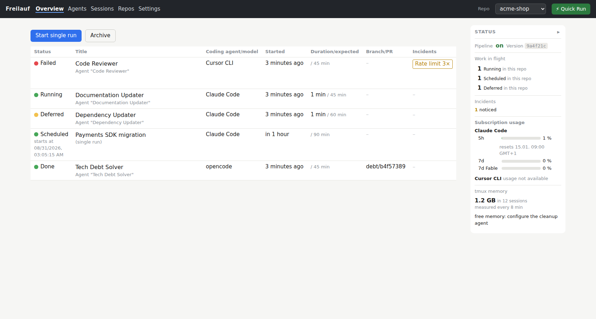
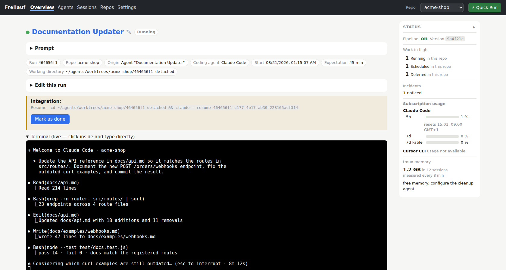
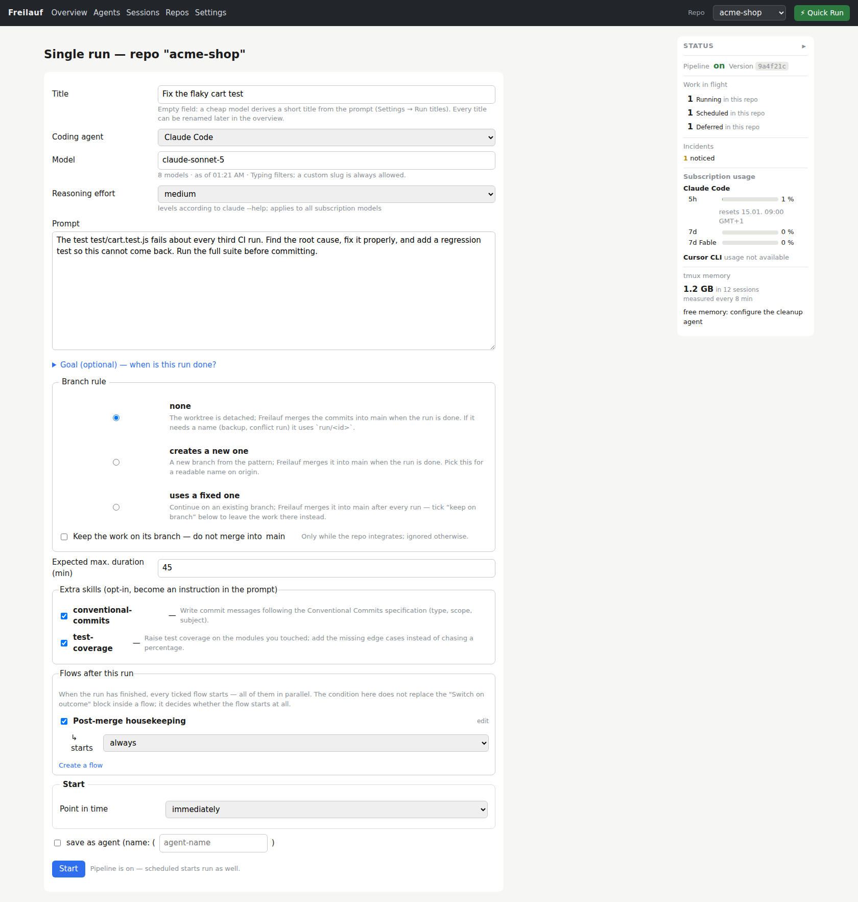
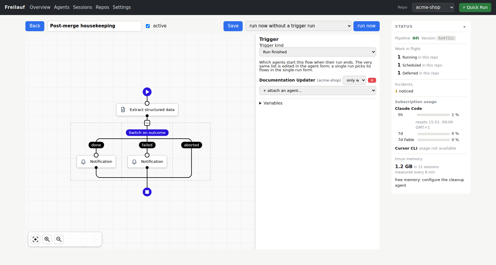
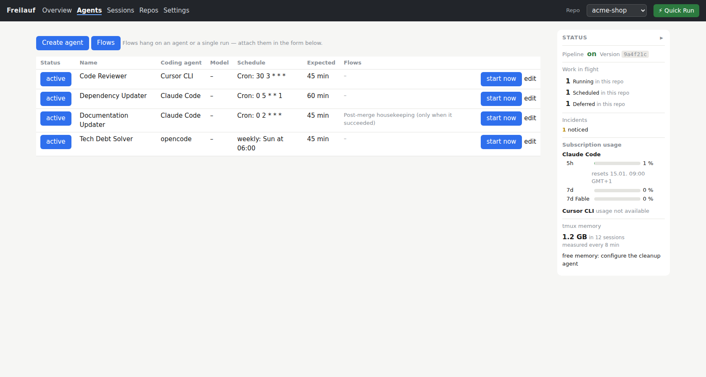

# Freilauf

**English** · [中文](README.zh-CN.md) · [Deutsch](README.de.md)

**Stop managing agents. Let them run free in your project.**

Imagine: you no longer have twenty terminals open at once. You have one place
where you hand out recurring jobs — *"find and eliminate dead code"*, *"raise
the test coverage"*, *"fix bugs"* … — and with every job you define an agent
that works on your project regularly, even while you sleep. You can hand out
new jobs at any time. A web UI keeps you in the picture: you can look into
every agent, configure flows, and have yourself notified. You go for a coffee
with your colleagues and your phone buzzes because another job is done. You
don't mind — you are enjoying the break that lets new ideas come.

That is Freilauf: a self-hosted web UI that runs a **standing team of coding
agents** — Claude Code, opencode, hermes, cursor, or any agent that arrives as
a plugin — on a schedule. Every run works in its own git worktree inside its
own tmux session, is watched for cost, progress and errors, and delivers its
work where you want it: **on a branch for review, or merged into `main` once
you trust the gate.**

> ### 🤖 Setting it up? Let your agent do it.
> You already use a coding agent. Point it at
> **[SETUP_WITH_AGENT.md](SETUP_WITH_AGENT.md)** — a guide written *for* agents
> that explains the system, asks you the handful of questions it cannot guess,
> and installs it. *"Read SETUP_WITH_AGENT.md and set this up for me."*

## Why "Freilauf"

*Freilauf* is German for a bicycle's freewheel: the part that keeps rolling
when you stop pedalling. And it is not the absence of control — it is a
**ratchet**: it lets the wheel run free, and only ever forward. That is how
Freilauf is built. A run is done only when its work has arrived. Nothing lives
only on this machine. No agent ever merges or pushes to your base branch —
Freilauf does, and it only goes forward.

*(Say "fry-lowf". Chinese: 弗莱劳夫.)*

## What Freilauf does

- **A workspace per run.** Every run gets its own git worktree and its own
  tmux session. Agents never step on each other — or on you — and you can
  attach to any of them later and read the whole screen.
- **Roles, not tickets.** An *agent* is a role with a schedule: the reviewer
  that runs every night, the dead-code hunter on Sundays, the docs keeper after
  every merge. A *single run* is the same form without the name and the
  schedule — and a **Quick Run** button on every page starts one from a saved
  favorite in two fields.
- **Watched, not trusted.** A budget gate before the start (Claude's 5-hour and
  7-day windows, Cursor's period, OpenRouter and DeepSeek credits — each
  optional, each with its own threshold), progress and cost while it runs,
  incidents when a provider fails or a rate limit hits (detected from the
  outside, because an agent that hit a rate limit cannot report anything), a
  report at the end — and a **finish gate** that does not take the agent's word
  for it: Freilauf checks the worktree, tells a still-running agent what is
  missing, merges in an integration worktree of its own, starts a conflict run
  when a merge fails, and calls you last.
- **Flows without code.** When a run ends, a flow can message another agent,
  start the next run and wait for it, extract structured data from a report via
  LLM, branch, loop, notify you, call a URL, run a shell command
  ([server/flows/AGENTS.md](server/flows/AGENTS.md)).
- **One window.** What runs, what it costs, what came out, what needs you — the
  overview, a live terminal in the browser (xterm.js, read-only by default),
  and notifications with a link straight to the run. The sidebar shows your
  subscription windows, provider balances and what every tmux session on the
  machine costs in memory; a configurable cleanup agent ends the oldest idle
  sessions when it grows too large.
- **Everything vendor-specific is a plugin.** Coding agents, model providers
  and notification services are plugins with a documented contract
  ([docs/plugins.md](docs/plugins.md)); a third party can drop a package on
  the machine that joins them at startup, with its own API-key handling, its
  own budget-gate thresholds and its own launch declaration. A **Plugins page**
  and a six-step **Welcome wizard** configure them; the hub's own small
  questions (naming a run, judging a log line, reading a report) can be
  answered by a coding agent on a subscription you already pay for.
- **It teaches your agents to drive it.** Freilauf ships **agent skills**
  (the open [agentskills.io](https://agentskills.io) format) that explain how
  to find and read runs, create agents and repositories, build flows, read the
  status panel and pick a model. Switch them on and they are copied into the
  directories your coding agents already read — one copy per directory, chosen
  so that no agent gets the same skill twice — and removed again, exactly and
  only the copies Freilauf wrote, when you switch them off.
- **Multilingual UI**: English (default), 中文, Deutsch — one clock and one
  number format across every page.

## Freilauf in pictures

*A small demo installation ("acme-shop") with a standing team of agents; the
UI language is selectable per installation.*


*The overview. One row per run — the Documentation Updater is working right
now, a Payments SDK migration is scheduled, the Dependency Updater waits for
its quota window, the Tech Debt Solver's work is already merged — with open
incidents, subscription windows and the machine's tmux memory in the sidebar.*


*Inside a run. The live terminal shows the agent working; around it the run's
definition, expected duration, and the finish gate that checks the worktree
when the agent reports done.*


*Starting a single run. Task, model and reasoning effort, branch rule, opt-in
skills, the flows that fire when the run ends, and when it should start —
optionally saved as an agent with a schedule.*


*Flows without code. This one extracts a summary and a risk rating from a
finished run's report, branches on the outcome, and notifies — attached to the
Documentation Updater so it fires every time that agent ends a run.*


*The standing team. Each agent is a role: a prompt, a schedule, a budget and
the flows that hang on it — startable at any time by hand.*

## Three ways in

- **Side by side.** Your team develops; the agent team takes the work nobody
  enjoys — dead code, reviews, dependency bumps, translations, the docs.
  Results arrive as branches for review; you decide what lands on `main`.
  Most people start here, and many stay.
- **By hand.** A single run when you need one: the migration, the cleanup, the
  one bug nobody has time for.
- **Fully autonomous.** Humans file issues and feature requests; the team does
  everything else, and Freilauf merges. Schedules, budget gates, the finish
  gate, conflict runs and escalation to a human are what make that operable
  rather than reckless. Nobody has to stand there today — the on-ramp is the
  same.

**You don't give up control. You move it up one level.** A team lead doesn't
sit next to every developer reading along either: they agree on what gets
done, set the rules, and read the results. That is your job from now on —
roles, schedules, budgets, the finish gate, when a human gets called. The team
does the rest, and Freilauf shows you all of it in one place.

And it is not only software. A run ends in a merge because code needs one; the
building blocks — roles, schedules, flows, LLM extraction, notifications, HTTP,
shell — have the same shape for a marketing routine, a documentation pipeline
or a back-office process: something that has to happen on time, be watched,
and be reported.

## Getting started

The short way: give your coding agent the path to this repository and say
*"Read SETUP_WITH_AGENT.md and install Freilauf."* It knows the steps below,
asks you only what it cannot guess (your WireGuard address, the host names,
where the certificates are) and verifies the result.

The long way, for the record. Prerequisites: Linux with systemd (user units),
Node.js ≥ 22 (`node:sqlite`), tmux, git, jq, curl, a WireGuard interface, and
at least one agent CLI (`claude`, `opencode`, `hermes`, `cursor-agent`) on the
`PATH`. Certificates e.g. with [mkcert](https://github.com/FiloSottile/mkcert).

```bash
./setup/01-npm-install.sh       # node-pty, ws, xterm.js — for THIS checkout (tests, editing)
./setup/02-install-scripts.sh   # fl-start/-attach/-kill/-help/-report/-notify + freilauf + freilauf-deploy → ~/.local/bin
./setup/03-install-services.sh  # ~/.config/freilauf/env (from env.example) + systemd units
sudo ./setup/04-firewall.sh     # ufw: VPN port only on wg0 (one-time)
```

Then set at least `FREILAUF_VPN_BIND` and `FREILAUF_ALLOWED_HOSTS` in
`~/.config/freilauf/env` (see [`env.example`](env.example)), place the
certificates, and bring the first version live:

```bash
freilauf-deploy --init --from "$PWD"   # clones into ~/agents/deploy/freilauf, deploys it
freilauf status                        # hub process, VPN access, pipeline, sessions, deployed sha
freilauf on                            # start the VPN proxy → reachable over WireGuard
```

**First thing in the UI:** a **Welcome wizard** — the first visit to `/` lands
there. It walks through what is installed on the machine, your first coding
agent, your first model provider and the model that answers the hub's own
small questions; notifications are optional and can be added later under
Settings → Notifications. "Do not show this again" retires it. An optional
seed file `~/.config/freilauf/coding-agents.json` pre-populates the coding
agents on first start, which is what makes a scripted setup reproducible.

> Verify reachability **from a VPN client**, never with `curl` on the server
> itself: that request travels over `lo` and says nothing about your firewall.

### Bringing a version live

The systemd units start `~/agents/deploy/freilauf` — a clone that belongs to
the hub alone, always detached on one commit. The checkout you work in never
runs a service, so uncommitted work can never end up being served.

```bash
freilauf deploy            # fetch, check out origin/main, deps (only if the lockfile moved),
                           # reinstall the fl-* scripts, restart, health check — rollback if it fails
freilauf deploy <ref>      # that commit instead
freilauf-deploy --status   # deployed sha, origin sha, how far behind
freilauf-deploy --rollback # back to the previously deployed commit
```

A failed deploy rolls back to the commit that was running and notifies you.
The running sha is printed in the sidebar of every page, so *"is my change
live?"* is a glance. `freilauf restart` stays what it says — a restart, without
a deploy.

## Security model — please read this one

The hub can control tmux. **That is shell access.** So:

- `server/hub.mjs` binds **firmly to `127.0.0.1`**; there is no direct path from
  the network.
- In front sits `vpn-proxy.mjs` (TLS), which binds **exclusively to your own
  WireGuard address**. `FREILAUF_VPN_BIND` is mandatory — there is deliberately
  no default. **WireGuard is the auth layer; Freilauf has no login of its own.**
- Host allowlist + origin check (`FREILAUF_ALLOWED_HOSTS`) fence off DNS
  rebinding and CSRF; `Sec-Fetch-Site: cross-site` is rejected.
- **Fail-closed**: `freilauf-vpn.service` deliberately does *not* start after a
  reboot (`freilauf on` enables access), and `setup/04-firewall.sh` allows the
  VPN port only on `wg0`, denying it everywhere else.
- Every run works in its own worktree; agents never merge or push to the base
  branch — Freilauf does; and everything a run does is a report, an event or an
  incident you can read afterwards.

**Never run the hub in a reachable network without these layers.**

## FAQ

**What is the difference to harness engineering?**
Harness engineering — the docs, tests, linters and feedback loops that let one
coding agent such as Claude Code work autonomously and still deliver quality —
is work inside your repository. Freilauf is the level above it: it takes agents
that have been made trustworthy that way and lets **many of them work regularly
and unattended** — scheduled, isolated, watched, integrated, escalated.
Freilauf does not replace harness engineering; it builds on it. A well-built
harness is exactly what makes an agent worth running on a schedule.

**Can I bring my own coding agent (Claude Code, GitHub Copilot, …)?**
Claude Code, opencode, hermes and cursor-agent are built in. A coding agent
that is not — Copilot CLI, Codex CLI, whatever comes next — is a plugin file
(or a package outside this repository) with a launch declaration;
[docs/plugins.md](docs/plugins.md) has the contract. The simplest way: tell
your agent *"read docs/plugins.md and add X as a coding-agent plugin"*.

**Can I use my subscription (e.g. a Claude Max plan)?**
Yes. Claude Code runs on your Claude subscription and cursor on yours —
Freilauf starts the CLI you already have, it never calls the vendor's API for
a run itself. It even reads the subscription's usage windows and defers a start
before a quota is empty.

**Do I need API keys? Will I run up expensive API costs?**
No keys are required. Your subscription covers Claude Code and cursor runs;
opencode works without a key on OpenCode Zen's free models; hermes needs a
provider key (OpenRouter or DeepSeek). The hub's own small questions can be
answered by a coding agent on your subscription, so a whole installation can
run with no API key anywhere. What you pay is whatever your subscription or
provider bills you — Freilauf itself costs nothing.

**What do I need?**
A Linux machine with systemd user units (Ubuntu works), Node.js ≥ 22, tmux,
git, jq, curl, at least one coding-agent CLI on the `PATH`, and a secured way
to reach the web UI — Freilauf's proxy binds exclusively to a WireGuard
address. Don't worry: your agent sets all of it up
([SETUP_WITH_AGENT.md](SETUP_WITH_AGENT.md)) and asks you only what it cannot
guess.

**Which coding agents and providers are supported?**
Coding agents: Claude Code, opencode, hermes, cursor-agent. Model providers:
OpenRouter, DeepSeek, OpenCode Zen. Notifications: Telegram. All three kinds
are plugins — adding another is one file, and your agent can write it.

**May I use it commercially?**
Yes. [CC BY 4.0](LICENSE): use it, change it, sell it — name the author and
link back.

**May I develop it further?**
Absolutely — and please send your pull request. Your agent knows how
([CONTRIBUTING.md](CONTRIBUTING.md)).

**What does it cost?**
Nothing. No license fee, no hosted service, no telemetry.

**What about security?**
The hub is only ever reachable through your own VPN, has no login of its own
because WireGuard *is* the login, works fail-closed, and keeps every agent in
its own worktree. The whole model is in
[Security model](#security-model--please-read-this-one) above — read it before
you expose anything.

**Can I control the agents from the terminal too?**
Yes. Every run is a tmux session; `fl-attach` drops you into it, and plain
`tmux attach` works as well. The browser terminal shows the same session.

**Can I add other notification services?**
Yes — notifications are plugins. Telegram ships built in, none is required, and
a webhook, Slack or e-mail notifier is a small plugin file
([docs/plugins.md](docs/plugins.md)).

**How do I install it?**
Give your coding agent the path to the repository and say *"Read
SETUP_WITH_AGENT.md and install Freilauf."* The manual steps are under
[Getting started](#getting-started).

**I have questions.**
Gladly! Open a GitHub issue, or write me an e-mail — the address is on
[entwickler-training.de](https://entwickler-training.de).

**We are thinking about introducing this in our company. Is there consulting?**
Yes — please book a consultation at
[entwickler-training.de](https://entwickler-training.de). I don't only consult;
I run whole trainings.

## Tests

```bash
node test/unit.mjs          # pure logic (cron, schedules, quota gate, parsers, registries, i18n, docs) — ~1 s
node test/e2e.mjs           # complete hub in a sandbox, stub instead of real agents — ~40 s
node test/e2e.mjs --echt    # additionally ONE real run per harness (consumes quota)
node test/browser.mjs       # public/hub.js in a real Chromium — ~10 s (needs playwright)
node test/proxy.mjs         # vpn-proxy.mjs against a stub upstream — <1 s
node test/deploy.mjs        # bin/freilauf-deploy against a bare origin — ~3 s
```

The e2e suite starts a second hub on a free port with its own database, test
repo and `fl-start` stub — it touches neither production data nor foreign tmux
sessions, so it is safe to run next to a live hub.

## Make it yours

Freilauf is one operator's workflow turned into code, published because it
might save you a month. **Fork it, change it, rip parts out.** The seams meant
to be pulled on: coding agent, model provider and notification plugins —
including packages that live outside this repository entirely — the platform
prompt suffix, per-repo prompts, opt-in extra skills, the agent skills the hub
ships for your coding agents, the model source behind the hub's own questions,
and the no-code flows.
[SETUP_WITH_AGENT.md](SETUP_WITH_AGENT.md) has the table;
[docs/plugins.md](docs/plugins.md) has the plugin contract in full.

## Contributing

**Pull requests are very welcome** — bug reports, plugin files for further
coding agents, providers or notifiers, translations, documentation fixes alike.
The ground rules and the pre-submit checklist are in
[CONTRIBUTING.md](CONTRIBUTING.md).

Developer knowledge — architecture decisions, harness quirks, and a long list of
pitfalls that already cost somebody an afternoon — lives in
[AGENTS.md](AGENTS.md), written for humans **and** coding agents.

## License

[CC BY 4.0](LICENSE) — use it, change it, ship it commercially. Just give
credit: name **Herbert Walde**, link back to
<https://github.com/hwalde/freilauf>, link the license, and say if you changed
something.
