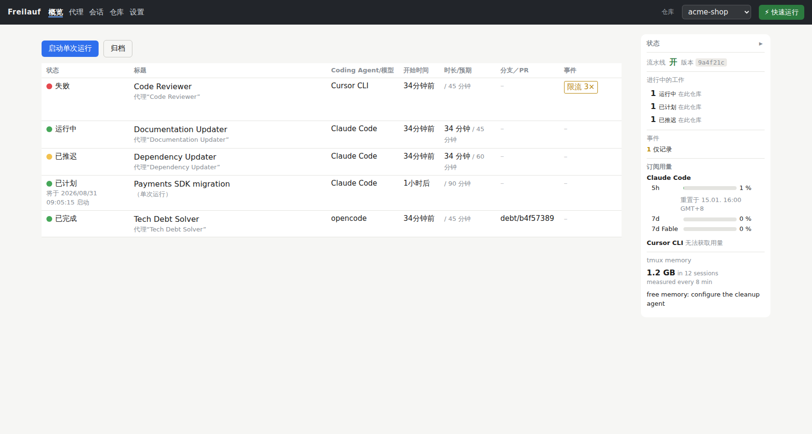
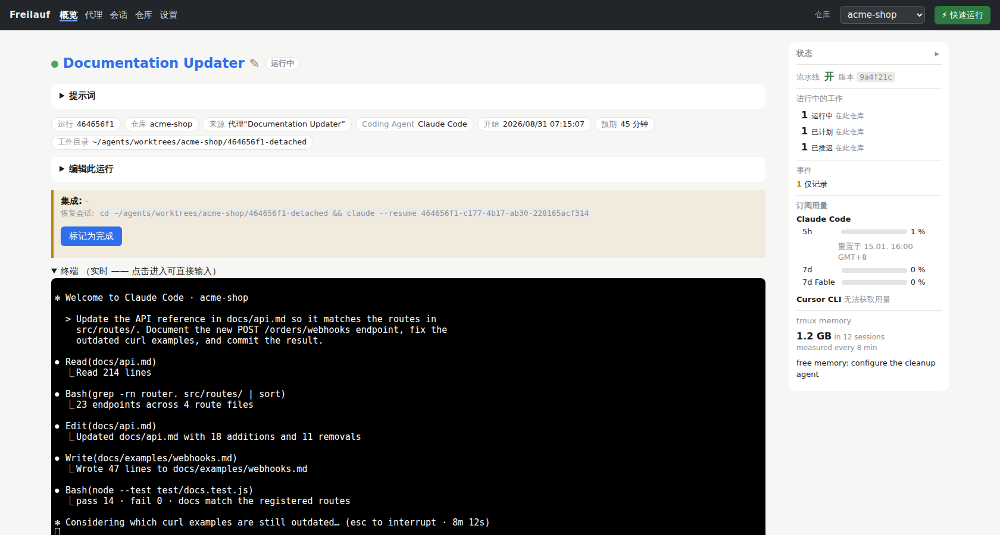
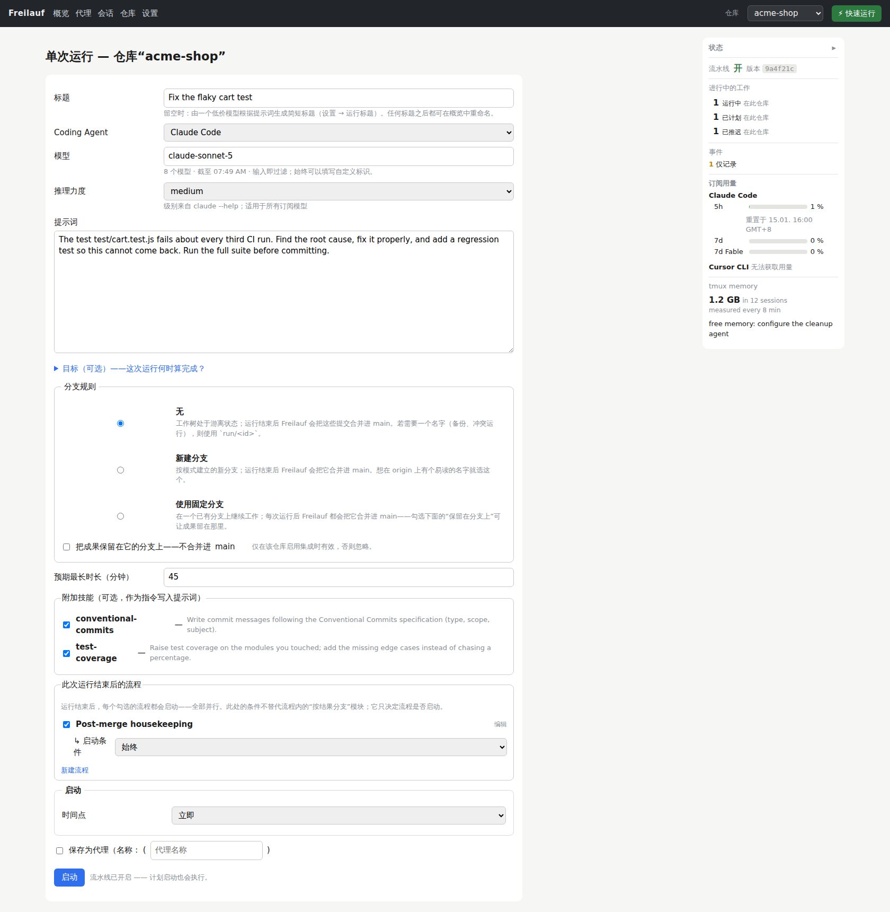
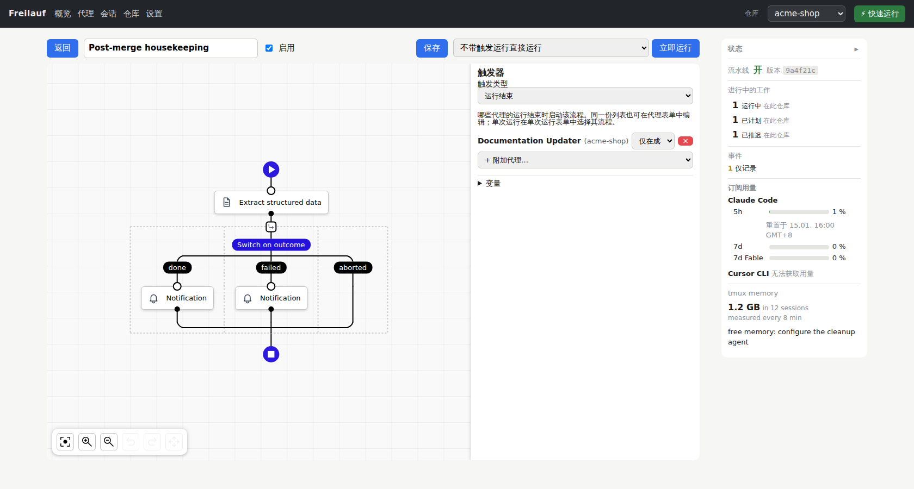
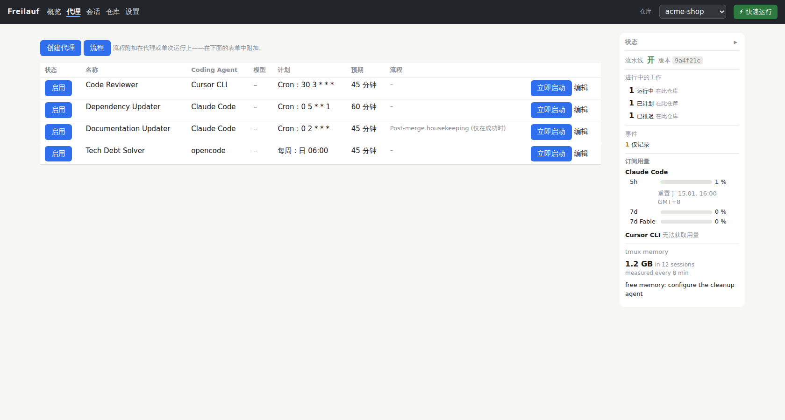

# Freilauf（弗莱劳夫）

[English](README.md) · **中文** · [Deutsch](README.de.md)

**别再管理智能体了。让它们在你的项目里自由奔跑！**

想象一下：你不再同时开着二十个终端，而是只有一个界面，在那里分派周期性的任务——
*「找出并清除死代码」*、*「提高测试覆盖率」*、*「修复 bug」*……——每分派一个任务，
就定义了一个定期为你的项目工作的智能体，哪怕你在睡觉。你随时可以分派新的任务。
通过网页界面，你对全局了如指掌：可以查看每一个智能体、配置流程、接收通知。你和同事
去咖啡馆，手机震了一下，因为又有一个任务完成了。你并不在意——你正享受这段让新点子
冒出来的休息时间。

这就是 Freilauf：一个自托管的网页界面，按计划运行一支**固定的编码智能体团队**——
Claude Code、opencode、hermes、cursor，或任何以插件形式加入的智能体。每次运行都在
自己的 git 工作树和 tmux 会话里进行，全程监控成本、进度和错误，并把成果送到你指定的
地方：**送到分支上等待评审，或者在你信任门槛之后，直接合入 `main`。**

> ### 🤖 要安装？交给你的智能体。
> 你已经在用编码智能体了。把
> **[SETUP_WITH_AGENT.md](SETUP_WITH_AGENT.md)** 交给它——这是一份*为*智能体写的
> 指南：解释系统、向你提出它猜不出来的几个问题，然后完成安装。
> *「读一下 SETUP_WITH_AGENT.md，帮我把它装好。」*

## 为什么叫「Freilauf」

*Freilauf* 是德语里自行车「飞轮」的意思：你停止蹬踏，车轮照样往前转。它不是撒手不管
——它是一个**棘轮**：让车轮自由转动，但只能向前。Freilauf 就是这样造的。成果落地，
运行才算完成。没有任何东西只存在于这一台机器上。智能体从不向你的主分支合并或推送
——由 Freilauf 来做，而且只会向前。

*（发音近似「fry-lowf」，中文可写作「弗莱劳夫」。）*

## Freilauf 做什么

- **每次运行一个工作区。** 每次运行都有自己的 git 工作树和 tmux 会话。智能体之间
  互不干扰——也不会干扰你；事后你可以接入任何一个会话，读完整个屏幕。
- **角色，而不是工单。** 一个*智能体*就是一个带排期的角色：每晚运行的评审员、
  周日的死代码猎手、每次合并后的文档维护者。*单次运行*是同一张表单，只是没有名字和
  排期——每个页面上的 **Quick Run** 按钮能用两个字段从收藏的配置启动一次运行。
- **监督，而非信任。** 启动前有预算门槛（Claude 的 5 小时和 7 天窗口、Cursor 的
  计费周期、OpenRouter 和 DeepSeek 的余额——每一项都可选，各有自己的阈值），运行中
  跟踪进度和成本，提供商故障或触发限流时生成事件（从外部检测，因为被限流的智能体
  什么也报告不了），结束时有报告——还有一个**完成门槛**，它不听智能体的一面之词：
  Freilauf 检查工作树，告诉仍在运行的智能体还缺什么，在自己的集成工作树里合并，
  合并失败时启动冲突处理运行，最后才来找你。
- **无需编码的流程。** 一次运行结束时，流程可以给另一个智能体发消息、启动下一次
  运行并等待结果、用 LLM 从报告中提取结构化数据、分支、循环、通知你、调用 URL、
  执行 shell 命令（[server/flows/AGENTS.md](server/flows/AGENTS.md)）。
- **一个窗口。** 正在运行什么、花了多少、产出了什么、哪里需要你——总览、浏览器里的
  实时终端（xterm.js，默认只读）、直接链接到运行的通知。侧边栏显示你的订阅窗口、
  提供商余额，以及这台机器上每个 tmux 会话占用的内存；可配置的清理智能体会在占用
  过大时结束最老的空闲会话。
- **一切厂商相关的东西都是插件。** 编码智能体、模型提供商和通知服务都是有文档化
  契约的插件（[docs/plugins.md](docs/plugins.md)）；第三方可以把一个包放到机器上，
  启动时自动加入——带着自己的 API 密钥处理、自己的预算阈值和自己的启动声明。
  一个**插件页面**和一个六步的**欢迎向导**负责配置；中枢自己的小问题（给运行命名、
  判断日志行、读取报告）可以由你已经付费订阅的编码智能体来回答。
- **项目可以收起来而不必丢掉。** 停用一个仓库后，它会从所有下拉列表中消失、不再启动
  任何新工作，而其中的每一次运行、每个智能体和每份报告都完整保留且仍可访问——一键即可
  恢复。也可以删除：删除需要输入仓库名，只要还有工作在进行就会被拒绝，并且永远不会
  触碰你的 git 检出目录。
- **它会教你的智能体使用自己。** Freilauf 附带自己的**代理技能**（采用
  [agentskills.io](https://agentskills.io) 的开放格式），讲解如何查找和阅读运行、
  创建智能体与仓库、搭建流程、阅读状态面板以及选择模型。开启后它们会被复制到你的
  编码智能体本就会读取的目录——每个目录一份，且保证同一个智能体不会拿到重复的技能；
  关闭时只会精确删除 Freilauf 写入的那些副本，其他一概不动。
- **多语言界面**：英语（默认）、中文、德语——所有页面统一的时钟和数字格式。

## Freilauf 界面一览

*一个小型演示安装（「acme-shop」），带着一支常驻的智能体团队；界面语言按安装
自行选择。*


*概览页。每次运行一行——Documentation Updater 正在工作中，Payments SDK 迁移
已排期，Dependency Updater 在等待配额窗口，Tech Debt Solver 的成果早已合入；
右侧侧栏显示打开的事件、订阅用量和整台机器的 tmux 内存。*


*运行内部。实时终端里能看到智能体正在干活；周围是这次运行的定义、预期时长，
以及当智能体报告完成时检查工作区的完成门槛。*


*启动一次单次运行。任务、模型与推理力度、分支规则、可选技能、运行结束后
触发的流程，以及什么时候启动——也可以一键存成带时间表的智能体。*


*无代码流程。这个流程从已结束运行的报告中提取摘要与风险等级，按结果分支并
发送通知——挂在 Documentation Updater 上，它每次运行结束都会触发。*


*常驻团队。每个智能体是一个角色：一段提示词、一个时间表、一个预算和挂在它
身上的流程——随时可以手动启动。*

## 三种进入方式

- **并肩工作。** 你们的团队负责开发；智能体团队接手没人爱干的活——死代码、评审、
  依赖升级、翻译、文档。成果以分支形式送来评审；由你们决定什么合入 `main`。
  大多数人从这里开始，也有很多人一直留在这里。
- **手动运行。** 需要的时候跑一次：那次迁移、那次清理、那个谁都没时间修的 bug。
- **完全自主。** 人类只提 issue 和功能需求；团队做其余一切，由 Freilauf 合并。
  排期、预算门槛、完成门槛、冲突处理运行和向人类升级，是让这种模式可运营而非
  鲁莽的保障。今天没有人必须站到这一步——但上坡的路是同一条。

**你没有放弃控制，你只是把控制上移了一层。** 团队负责人也不会坐在每个开发者旁边
盯着屏幕：他约定要做什么、定下规则、读结果。从现在起这就是你的工作——角色、排期、
预算、完成门槛、何时叫人介入。其余的交给团队，Freilauf 把这一切放在一个地方给你看。

而且不只是软件。运行以合并结束，是因为代码需要合并；这些积木——角色、排期、流程、
LLM 提取、通知、HTTP、shell——对一条营销例程、一条文档流水线或一个后台流程来说
形状完全相同：某件必须按时发生、被监督、被汇报的事。

## 开始使用

捷径：把这个仓库的路径交给你的编码智能体，说*「读一下 SETUP_WITH_AGENT.md，安装
Freilauf。」* 它知道下面的步骤，只会问你它猜不出的事（你的 WireGuard 地址、主机名、
证书放在哪里），并验证结果。

完整步骤，供参考。前提：带 systemd（用户单元）的 Linux、Node.js ≥ 22
（`node:sqlite`）、tmux、git、jq、curl、一个 WireGuard 接口，以及 `PATH` 中至少
一个智能体 CLI（`claude`、`opencode`、`hermes`、`cursor-agent`）。证书可用
[mkcert](https://github.com/FiloSottile/mkcert) 生成。

```bash
./setup/01-npm-install.sh       # node-pty、ws、xterm.js —— 用于当前检出（测试、编辑）
./setup/02-install-scripts.sh   # fl-start/-attach/-kill/-help/-report/-notify + freilauf + freilauf-deploy → ~/.local/bin
./setup/03-install-services.sh  # ~/.config/freilauf/env（来自 env.example）+ systemd 单元
sudo ./setup/04-firewall.sh     # ufw：VPN 端口仅在 wg0 上放行（一次性）
```

然后在 `~/.config/freilauf/env` 中至少设置 `FREILAUF_VPN_BIND` 和
`FREILAUF_ALLOWED_HOSTS`（见 [`env.example`](env.example)），放好证书，把第一个
版本上线：

```bash
freilauf-deploy --init --from "$PWD"   # 克隆到 ~/agents/deploy/freilauf 并部署
freilauf status                        # 中枢进程、VPN 访问、流水线、会话、已部署的提交
freilauf on                            # 启动 VPN 代理 → 可通过 WireGuard 访问
```

**界面里的第一件事：** 一个**欢迎向导**——第一次访问 `/` 就会进入。它会带你看这台
机器上装了什么、你的第一个编码智能体、第一个模型提供商，以及回答中枢自身小问题的
模型；通知是可选的，之后可以在 设置 → 通知 里添加。「不再显示」可以关闭它。可选的
种子文件 `~/.config/freilauf/coding-agents.json` 会在首次启动时预填编码智能体——
这让脚本化的安装可以复现。

> 请**从 VPN 客户端**验证可达性，不要在服务器上用 `curl`：那条请求走的是 `lo`，
> 说明不了防火墙的任何问题。

### 上线一个版本

systemd 单元启动的是 `~/agents/deploy/freilauf`——一个只属于中枢的克隆，始终以
detached 状态停在某个提交上。你工作的检出永远不运行服务，未提交的工作因此永远不会
被对外提供。

```bash
freilauf deploy            # fetch，检出 origin/main，依赖（仅当 lockfile 变化时），
                           # 重新安装 fl-* 脚本，重启，健康检查 —— 失败则回滚
freilauf deploy <ref>      # 改为部署该提交
freilauf-deploy --status   # 已部署提交、origin 提交、落后多少
freilauf-deploy --rollback # 回到上一次部署的提交
```

部署失败会回滚到正在运行的提交并通知你。每个页面的侧边栏都会显示正在运行的提交，
所以*「我的改动上线了吗？」*一眼可见。`freilauf restart` 就是字面意思——只重启，
不部署。

## 安全模型——请务必阅读

中枢可以控制 tmux。**那就是 shell 访问权限。** 所以：

- `server/hub.mjs` **牢牢绑定在 `127.0.0.1`**；从网络没有任何直达路径。
- 前面是 `vpn-proxy.mjs`（TLS），它**只绑定在你自己的 WireGuard 地址上**。
  `FREILAUF_VPN_BIND` 是必填项——故意不提供默认值。**WireGuard 就是认证层；
  Freilauf 没有自己的登录。**
- 主机白名单 + Origin 检查（`FREILAUF_ALLOWED_HOSTS`）挡住 DNS 重绑定和 CSRF；
  `Sec-Fetch-Site: cross-site` 会被拒绝。
- **故障关闭**：`freilauf-vpn.service` 在重启后故意*不*自动启动（`freilauf on`
  开启访问），`setup/04-firewall.sh` 只在 `wg0` 上放行 VPN 端口，其他地方一律拒绝。
- 每次运行都在自己的工作树里；智能体从不向基础分支合并或推送——由 Freilauf 来做；
  运行做的每一件事事后都是一份报告、一个事件或一个事件记录，可以查阅。

**没有这些层，绝不要把中枢放在可达的网络里运行。**

## 常见问题

**这和 Harness Engineering（线束工程）有什么区别？**
Harness Engineering——让 Claude Code 这样的单个编码智能体能够完全自主工作、同时仍
交付质量的文档、测试、linter 和反馈回路——是在你仓库*内部*做的工作。Freilauf 是它的
上一层：把这样变得可信的智能体拿过来，让**很多个智能体定期、无人值守地工作**——
按计划、隔离、监督、集成、升级。Freilauf 不替代 Harness Engineering，而是建立在它
之上。一个打磨好的 harness，正是让一个智能体值得按计划运行的东西。

**我能带上自己的编码智能体吗（Claude Code、GitHub Copilot……）？**
Claude Code、opencode、hermes 和 cursor-agent 是内置的。不在其中的编码智能体——
Copilot CLI、Codex CLI，或者下一个出现的——是一个带启动声明的插件文件（或仓库之外
的一个包）；契约在 [docs/plugins.md](docs/plugins.md)。最简单的办法：告诉你的智能体
*「读一下 docs/plugins.md，把 X 加为编码智能体插件」*。

**我能用自己的订阅吗（比如 Claude Max）？**
可以。Claude Code 跑在你的 Claude 订阅上，cursor 跑在它自己的订阅上——Freilauf
启动的是你已经有的 CLI，运行时从不自己调用厂商的 API。它甚至会读取订阅的用量窗口，
在额度耗尽之前推迟启动。

**需要 API 密钥吗？会产生昂贵的 API 费用吗？**
不需要密钥。你的订阅覆盖 Claude Code 和 cursor 的运行；opencode 无需密钥即可使用
OpenCode Zen 的免费模型；hermes 需要一个提供商密钥（OpenRouter 或 DeepSeek）。中枢
自身的小问题可以由你订阅下的编码智能体回答——所以整套安装可以在没有任何 API 密钥
的情况下运行。你付的只是订阅或提供商向你收取的费用——Freilauf 本身不收费。

**我需要准备什么？**
一台带 systemd 用户单元的 Linux 服务器（Ubuntu 可用）、Node.js ≥ 22、tmux、git、
jq、curl、`PATH` 中至少一个编码智能体 CLI，以及一条安全的网页界面访问通道——
Freilauf 的代理只绑定 WireGuard 地址。别担心：你的智能体会把这些全部装好
（[SETUP_WITH_AGENT.md](SETUP_WITH_AGENT.md)），只问你它猜不出的事。

**支持哪些编码智能体和提供商？**
编码智能体：Claude Code、opencode、hermes、cursor-agent。模型提供商：OpenRouter、
DeepSeek、OpenCode Zen。通知：Telegram。这三类都是插件——再加一个就是一个文件，
你的智能体能写。

**可以商用吗？**
可以。[CC BY 4.0](LICENSE)：使用、修改、销售——注明作者并回链即可。

**可以继续开发吗？**
当然——而且请一定把你的 Pull Request 发给我。你的智能体知道怎么做
（[CONTRIBUTING.md](CONTRIBUTING.md)）。

**要花多少钱？**
一分不花。没有许可费，没有托管服务，没有遥测。

**安全性如何？**
中枢只能通过你自己的 VPN 访问，没有自己的登录，因为 WireGuard *就是*登录；故障
关闭；每个智能体都在自己的工作树里。完整模型见上文
[安全模型](#安全模型请务必阅读)——在对外开放任何东西之前先读一遍。

**也能从终端控制智能体吗？**
能。每次运行都是一个 tmux 会话；`fl-attach` 直接把你带进去，普通的 `tmux attach`
也一样。浏览器终端显示的是同一个会话。

**能添加其他通知服务吗？**
能——通知是插件。Telegram 内置，但没有任何一个是必需的；webhook、Slack 或邮件通知
器只是一个小小的插件文件（[docs/plugins.md](docs/plugins.md)）。

**怎么安装？**
把仓库路径交给你的编码智能体，说*「读一下 SETUP_WITH_AGENT.md，安装 Freilauf。」*
手动步骤见 [开始使用](#开始使用)。

**我有问题。**
欢迎！开一个 GitHub issue，或者给我发邮件——地址在
[entwickler-training.de](https://entwickler-training.de)。

**我们在考虑在公司里引入它。有咨询服务吗？**
有——请到 [entwickler-training.de](https://entwickler-training.de) 预约咨询。谢谢！
我不只提供咨询，也提供完整的培训课程。

## 测试

```bash
node test/unit.mjs          # 纯逻辑（cron、排期、配额门槛、解析器、注册表、i18n、文档）—— 约 1 秒
node test/e2e.mjs           # 沙箱中的完整中枢，用桩替代真实智能体 —— 约 40 秒
node test/e2e.mjs --echt    # 额外为每个 harness 跑一次真实运行（消耗配额）
node test/browser.mjs       # 在真实 Chromium 中测试 public/hub.js —— 约 10 秒（需要 playwright）
node test/proxy.mjs         # vpn-proxy.mjs 对桩上游 —— <1 秒
node test/deploy.mjs        # bin/freilauf-deploy 对裸 origin —— 约 3 秒
```

e2e 套件会在一个空闲端口上启动第二个中枢，带自己的数据库、测试仓库和 `fl-start`
桩——既不碰生产数据，也不碰别人的 tmux 会话，可以安全地与线上中枢并行运行。

## 变成你自己的

Freilauf 是一位运维者的工作流写成的代码，公开出来是因为它可能帮你省下一个月。
**Fork 它、改它、拆掉不要的部分。** 专门留出来可以拉动的接缝：编码智能体、模型
提供商和通知插件——包括完全位于本仓库之外的包——平台提示词后缀、按仓库的提示词、
可选的额外技能、中枢为你的编码智能体附带的代理技能、中枢自身问题背后的模型来源，
以及无代码流程。
[SETUP_WITH_AGENT.md](SETUP_WITH_AGENT.md) 有一览表；
[docs/plugins.md](docs/plugins.md) 有完整的插件契约。

## 参与贡献

**非常欢迎 Pull Request**——bug 报告、更多编码智能体/提供商/通知器的插件文件、
翻译、文档修正，一视同仁。基本规则和提交前清单在
[CONTRIBUTING.md](CONTRIBUTING.md)。

开发者知识——架构决策、各 harness 的怪癖，以及一长串已经让某人耗掉一个下午的坑——
都在 [AGENTS.md](AGENTS.md) 里，同时写给人**和**编码智能体看。

什么时候改了什么，都记在 [CHANGELOG.md](CHANGELOG.md) 里。本项目没有发布版本——
hub 直接从 `main` 部署——所以它按天分组，而不是按版本号。

接下来要做什么，写在 [ROADMAP.md](ROADMAP.md)（英文）里——它有意不是一份完整清单，
只列出少数大到值得提前公布的变化。**欢迎提功能需求：** 开一个
[issue](https://github.com/hwalde/freilauf/issues)，告诉我你缺什么。

## 许可证

[CC BY 4.0](LICENSE)——使用、修改、商业发布都可以。只需署名：注明 **Herbert
Walde**，回链到 <https://github.com/hwalde/freilauf>，链接许可证，并说明你是否
做了修改。
